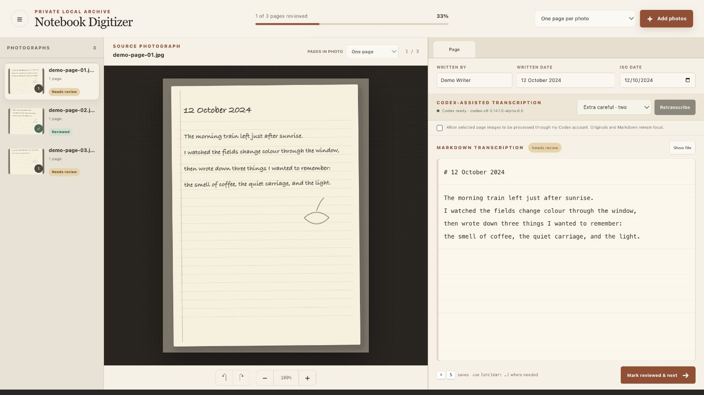
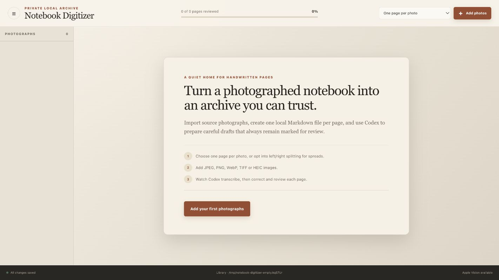

# Notebook Digitizer

Notebook Digitizer is a private, local-first web app for turning photographed notebooks into reviewable Markdown. It preserves original photographs, creates one Markdown file per physical page, and can ask the user's installed Codex CLI to prepare a careful transcription draft.

The interface and filesystem service run on your computer. There is no hosted account or database.

## Screenshots



_Review the source photograph and editable Markdown side by side. The example notebook shown here is entirely synthetic._



_A fresh local library, ready for its first photographs._

## What it does

- Imports HEIC, JPEG, PNG, WebP and TIFF photographs.
- Archives originals with SHA-256 checksums and skips exact duplicates.
- Treats each photograph as one page by default, with optional left/right splitting for two-page spreads.
- Lets you correct an imported photo between one-page and left/right layouts without re-uploading it.
- Stores entries as portable Markdown with YAML frontmatter.
- Provides side-by-side image review, zoom, rotation and autosave.
- Tracks `Needs review` and `Reviewed` states.
- Uses Apple Vision as an optional on-device OCR hint on macOS.
- Runs careful or two-pass extra-careful transcription through the user's Codex CLI, with a live local activity stream.
- Never lets Codex write directly to the notebook library.

## Requirements

- Node.js 22.13 or newer.
- npm.
- Codex or the ChatGPT desktop app if you want Codex-assisted transcription.
- On macOS, Swift and Apple Vision are detected automatically. They are optional.

## Run locally

```sh
git clone https://github.com/James-E-Adams/notebook-digitizer.git
cd notebook-digitizer
npm install
npm run notebook
```

Open the local URL shown in the terminal. The server binds to `127.0.0.1` only.

By default, notebook data is stored in `~/Documents/Notebook Digitizer Library`. To use another directory, copy `.env.example` to `.env.local` and set an absolute `NOTEBOOK_LIBRARY` path.

## Transcription workflow

1. Leave the default at **One page per photo**, or opt into **Two-page spread** when a photograph really contains left and right pages.
2. Import photographs.
3. Open a page and explicitly allow the selected page to be processed through your Codex account.
4. Choose **Careful** for one Codex pass or **Extra careful** for transcription plus independent verification. The activity panel shows the current stage and a curated live tail of Codex's JSONL events.
5. Correct the Markdown and mark the page reviewed.

You can change **Pages in photo** from the source photograph header at any time. Moving from one page to a spread keeps the existing entry as the left page and creates a new right page. Moving back to one page joins both Markdown bodies. Before either change, the app copies the affected entry files into `entries/.layout-archive/` so previous versions remain recoverable.

Apple Vision's OCR output is supplied to Codex only as a noisy hint. Codex receives both the cropped page and the uncropped source photograph. The service runs `codex exec --json`, relays safe progress events to the local interface, validates the final result against `transcription/transcription.schema.json`, and writes the Markdown atomically.

Notebook photographs sent for Codex-assisted transcription are processed according to the user's Codex account and settings. Manual editing remains available without Codex.

## Library format

```text
Notebook Digitizer Library/
├── notebook.json
├── originals/
├── derivatives/
│   ├── pages/
│   ├── thumbnails/
│   └── crops/
└── entries/
    ├── .layout-archive/
    ├── entry-0001.md
    └── entry-0002.md
```

Markdown files use immutable entry filenames. Correcting a date or author does not rename them.

## Configuration

- `NOTEBOOK_LIBRARY`: absolute path to the library directory.
- `CODEX_BIN`: optional absolute path to the Codex executable if it is not on `PATH`.

## Development

```sh
npm test
npm run lint
npm run build
```

The app is deliberately local-only. `.openai/hosting.json` contains no database or object-storage bindings, and no deployment is required.

## License

MIT. See `LICENSE`.
